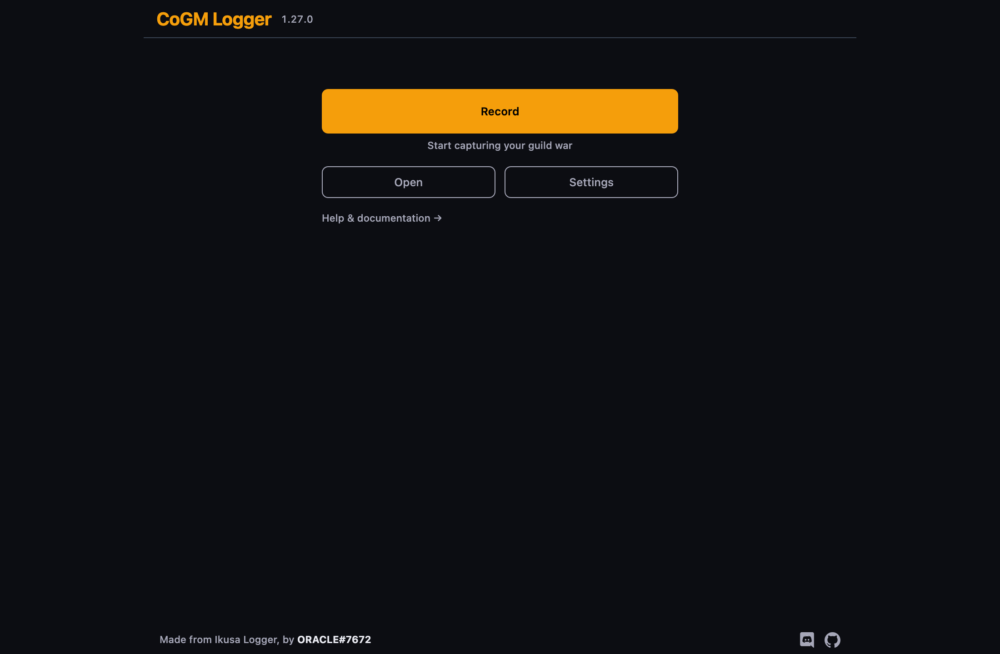
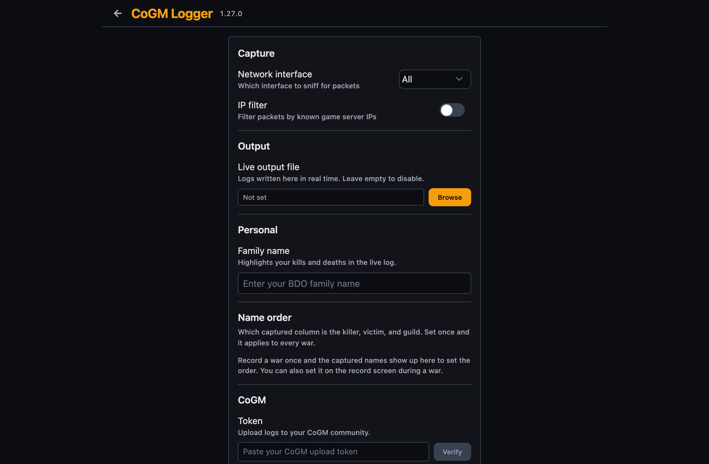

# CoGM Logger

Records the combat log of your Black Desert Online node wars and sieges, then uploads the war to your guild's [CoGM](https://cogm.app) event log in one click.

Built on [Ikusa Logger](https://github.com/sch-28/ikusa_logger) by [sch-28](https://github.com/sch-28). The capture engine, the config calibration, and the `.log` format are his work. This fork adds the CoGM upload pipeline, kill-location capture for the [kill heatmap](https://cogm.app), automatic packet recalibration after BDO patches, and CoGM branding. If you want a standalone visualizer instead of a guild platform, his [ikusa website](https://github.com/sch-28/ikusa) reads the same log files.



## What you get

Upload a war and CoGM turns it into:

- A full kill and death feed with per-player K/D for your guild, allies, and every enemy guild
- Kill locations plotted on the BDO map, with a heatmap across wars
- War recaps posted to your Discord, scoreboards, and guild-vs-guild history
- Class breakdowns, capped and uncapped detection, and per-player performance over time

The logger reads the same unencrypted combat messages the game already shows you in chat. It does not read memory, inject anything, or touch game files.

## Install

Grab the latest release from the [releases page](https://github.com/nots0ggy/cogm_logger/releases):

- `cogm-logger-installer.exe` installs it (Windows)
- `cogm-logger-portable.zip` runs from a folder, no install

The app keeps itself current. When a new version ships, it downloads and applies on the next launch.

## Record and upload a war

1. Open the logger and click `Record` before or during the fight.
2. Stop when the war ends. Check the name order at the top: it should read `Family-1 kills/died to Family-2 from Enemy-Guild`. If the order is wrong, flip it. You can also reopen any `.log` file later and fix the order.
3. Click `Upload`. The war lands in your guild's CoGM event log, parsed and scored.
4. Or click `Save` to keep the `.log` file and upload it from the CoGM dashboard later.

Uploading needs a logger token. A guild officer creates one in the CoGM dashboard under your guild's Settings, and you paste it into the logger's Settings once. Tokens are per guild, so wars land in the right event log.



## When a BDO patch breaks logging

Patches sometimes change the packets the game sends, and the logger stops reading kills. You do not have to wait for a new version:

1. The logger detects the unknown packet and blocks the bad upload.
2. Click `Send to CoGM`. The war goes to us for calibration.
3. We publish the corrected packet registry and every logger picks it up within minutes. Nothing to reinstall.

## Build from source

Users should take the installer above. Building is only needed for development.

Windows needs [Npcap 1.7.8](https://npcap.com/dist/), [Node.js 16+](https://nodejs.org/en/download/), and [Python 3](https://www.python.org/downloads/) with "Add Python to environment variables" checked. Linux needs `nodejs libcap python3 patchelf`.

```
git clone git@github.com:nots0ggy/cogm_logger.git
cd cogm_logger
build.bat        # Windows
./build.sh       # Linux
```

Start it with `dist/cogm-logger/cogm-logger-win_x64.exe` on Windows or `./start.sh` on Linux.

## Protocol research: full payload capture

The normal logger keeps a 300-byte window around the combat-log identifier and pulls out four fields. To study the rest of the protocol (gear, class, damage, position, objectives), the capture engine has a full mode that records the entire TCP payload of every packet from BDO's servers:

```
logger.exe -F -o captures/war.log
```

This writes `war.pcap` (open in Wireshark or read with scapy) and `war.jsonl` (one line per packet: `{time, src, dst, sport, dport, seq, len, hex}` for grepping and diffing payloads). It captures the same unencrypted traffic the combat logger reads, in full. Live combat logging is unaffected. Notes from this work live in [docs/](docs/).

## Troubleshooting

- Logger will not start: launch with `--mode=browser`.
- No packets while recording: reinstall [Npcap](https://npcap.com/dist/) with "WinPcap API-compatible mode" checked, then restart.
- Upload rejected: your token was revoked or the guild changed. Ask an officer for a fresh one.

## Help and credits

CoGM questions: join the [CoGM support server](https://discord.gg/rC4JEjEgnh).

The original logger is [ikusa_logger](https://github.com/sch-28/ikusa_logger) by sch-28 (Discord: sch.28). Go star it.
